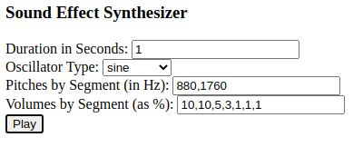

Sound Effect Synthesizer
========================

The JavaScript code in this repository allows the user to synthesize simple,
lo-fi sound effects using the AudioContext object.

Getting the Code
----------------

This repository contains a Git submodule, so in order for it to be buildable, 
it must be cloned using the "--recursive" switch on the "git clone" command:

	git clone --recursive https://github.com/thiscouldbebetter/SoundEffectSynthesizer

Alternatively, if the repository has already been cloned without using the switch,
the submodule can be pulled separately by running this command from within the 
Source/WavFileViewer subdirectory:

	git submodule update --init .

Building the Code
-----------------

With TypeScript installed, run "tsc" from within the Source directory.  If there is
no desire to modify the program, however, this step can be skipped, as the code
has already been transpiled and the resulting .js files included in the repository.

Running the Program
-------------------

To run the program, open the file Source/SoundEffectSynthesizer.html in a web browser
that runs JavaScript.